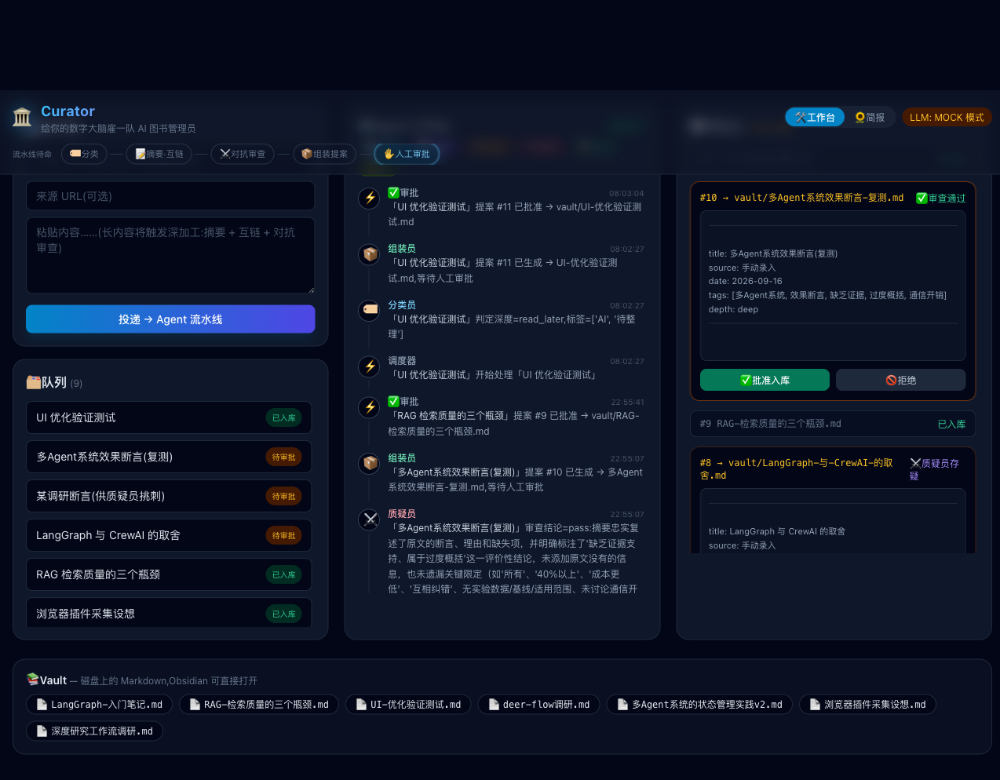
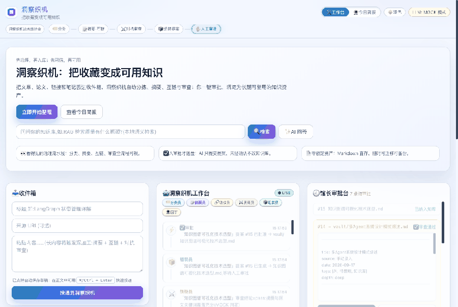

# 🧭 洞察织机 InsightLoom

[English](README_EN.md) | **简体中文**

> 把收藏编织成可行动的洞察。

**洞察织机（InsightLoom）** 是一个自托管的个人知识工作台:你把文章、论文、链接、笔记丢进收件箱,一队**看得见的 Agent** 分拣、摘要、互链、对抗审查,生成每日简报——**所有对知识库的修改都需要你审批后才落盘**。

> 品牌官网域名: `insightloomapp.com`（建设中）



**30 秒演示**:语义检索 → RAG 问答 → 投递 → Agent 流水线 → 审批入库 → 自动进入可检索索引



## 为什么是 洞察织机

现有的"AI 第二大脑"(如 khoj)大多是**被动检索**:你问,它答。洞察织机的差异在于**主动加工**:

- 🔍 **流水线可见**:打开 UI 就能看到分类员、摘要员、链接员、质疑员实时处理你的阅读队列
- ⚔️ **对抗审查**:质疑员对摘要员的产出做红队检查,过度概括、无中生有会被标记
- ✅ **人审批**:Agent 只提「提案」,批准之前一个字节都不会写进你的知识库
- 📄 **零锁定**:知识本体只是磁盘上的 Markdown 文件(Obsidian 可直接打开),SQLite 只存过程状态
- 🔌 **任意模型**:OpenAI 兼容协议,默认 DeepSeek,可切 Ollama 本地模型;无 Key 也能跑(MOCK 模式)

## Agent 流水线

```
              ┌──────────┐
              │ 🏷️ 分类员 │ depth=read_later
              │ (classify)│──────────────────────┐
              └────┬─────┘                       ▼
                   │ depth=deep            ┌───────────┐
          ┌────────┴────────┐              │ 📦 组装员  │
          ▼ (fan-out 并行)  │              │ (assemble)│
   ┌───────────┐   ┌───────────┐           └─────┬─────┘
   │ 📝 摘要员 │   │ 🔗 链接员 │                 │
   └─────┬─────┘   └─────┬─────┘                 │
         └──────┬─────────┘                       │
                ▼                                 │
         ┌───────────┐                             │
         │ ⚔️ 质疑员 │  (fan-in:等两者完成后对抗审查)
         └─────┬─────┘                             │
               └───────────────────────────────────┘
                        ⬇ 人工审批
                 vault/xxx.md(带 frontmatter + [[双链]])
```

- **分类员**按内容深度路由:短内容走「稍后读」快车道,长内容触发深加工(按需消耗 token)
- **摘要员 / 链接员**并行工作;链接员带幻觉防护,只引用真实存在的笔记
- **质疑员**等两者完成后对照原文做对抗式审查(结论:通过 / 存疑)
- **组装员**产出结构化提案(frontmatter + 摘要 + `[[双链]]` + 审查记录),进入审批队列

## 快速开始

```bash
# 环境要求:Python 3.10+(推荐 uv 管理)
uv venv --python 3.12 .venv
UV_CACHE_DIR=/tmp/uv-cache uv pip install --python .venv/bin/python \
    fastapi "uvicorn[standard]" langgraph langchain-core openai python-dotenv

# MOCK 模式(无需任何 API Key,体验完整流程)
CURATOR_LLM_MOCK=1 .venv/bin/uvicorn server.app:app --port 8300
# 打开 http://127.0.0.1:8300

# 真实模式(DeepSeek,几块钱够用很久)
CURATOR_LLM_API_KEY=sk-xxx .venv/bin/uvicorn server.app:app --port 8300
# 或任意 OpenAI 兼容服务:
CURATOR_LLM_API_KEY=sk-xxx CURATOR_LLM_BASE_URL=https://api.openai.com/v1 \
CURATOR_LLM_MODEL=gpt-4o-mini .venv/bin/uvicorn server.app:app
```

## 项目结构

```
curator/
├── server/
│   ├── app.py        # FastAPI:投递/状态/审批 API + 静态托管
│   ├── pipeline.py   # LangGraph Agent 流水线(分类→并行→对抗审查→提案)
│   ├── llm.py        # OpenAI 兼容封装 + MOCK 模式
│   └── store.py      # SQLite 过程状态 + vault Markdown 落盘
├── web/index.html    # 三面板工作台 UI(收件箱 / Agent 活动 / 审批)
├── vault/            # 你的知识库(纯 Markdown,Obsidian 兼容)
└── data/             # SQLite + 日志(运行时生成)
```

## API 一览

| 方法 | 路径 | 说明 |
|---|---|---|
| POST | `/api/inbox` | 投递内容 `{title, content, url?}`,触发流水线 |
| GET | `/api/state` | 聚合状态(条目/事件/提案/vault/LLM) |
| POST | `/api/proposals/{id}/approve` | 批准提案 → 写入 vault |
| POST | `/api/proposals/{id}/reject` | 拒绝提案 |
| POST | `/api/garden/run` | 🌻 触发园丁巡库(发现 + 双链提案) |
| GET | `/api/digest` | 每日简报:24h 统计 + vault 健康度 + 巡库发现 |
| GET | `/api/search?q=` | 语义检索 vault(本地嵌入,返回小节级命中) |
| POST | `/api/ask` | RAG 问答 `{question}`,回答带引用笔记 |
| POST | `/api/reindex` | 全量重建语义索引 |
| GET | `/api/health` | 健康检查 + LLM/检索状态 |

## 路线图

> 完整产品形态(五层架构/用户旅程/里程碑)见 **[docs/PRODUCT_VISION.md](docs/PRODUCT_VISION.md)**

- [x] **P0** 核心闭环:收件箱 → 五 Agent 流水线 → 审批 → vault 落盘
- [x] **P1a** 🌻 园丁 Agent:巡库检测孤立/过时/薄弱笔记,双链建议走统一审批(批准后自动追加 `[[双链]]` 到既有笔记)+ 每日简报页(24h 统计/标签/健康度)
- [x] **P1c** 检索层:本地向量库(Chroma + 本地 ONNX 嵌入,无需云 API)+ 语义检索 `/api/search` + 链接员语义化 + RAG 问答 `/api/ask`(带引用);审批落盘自动入索引
- [ ] **P1b** 知识图谱视图(双链可视化)、React 前端重构
- [ ] **P2** Docker 一键部署、采集端(bookmarklet → 浏览器插件 → Telegram bot)、demo GIF、正式发布(V2EX / 掘金 / HN / r/selfhosted)
- [ ] **P3** 本地模型适配(Ollama)、checkpointer 时间旅行、RSS/邮件采集、多用户

## 发布检查清单

- 最小发布清单见: **[`docs/LAUNCH_MIN_CHECKLIST.md`](docs/LAUNCH_MIN_CHECKLIST.md)**

## 近期执行记录

- 竞赛记录（/Residency）: **[`docs/COMPETITION__CUP_2026.md`](docs/COMPETITION__CUP_2026.md)**
- 初始化调整清单: **[`docs/INIT_ADJUSTMENTS.md`](docs/INIT_ADJUSTMENTS.md)**
- 参赛 BP 模板: **[`docs/BP_OUTLINE.md`](docs/BP_OUTLINE.md)**
- 参赛定位与复用指南: **[`docs/COMPETITION_POSITIONING.md`](docs/COMPETITION_POSITIONING.md)**
- 参赛叙事升维版(B 口径): **[`docs/BP_TEAM_NARRATIVE.md`](docs/BP_TEAM_NARRATIVE.md)**
- 技术证据页(评委可查证): **[`docs/PROOF_POINTS.md`](docs/PROOF_POINTS.md)**

## 设计决策记录(ADR 摘要)

1. **为什么 Markdown 而不是数据库存知识?** —— 零锁定是采纳第一动力;过程状态(SQLite)与知识本体(文件)分离,用户随时带着文件走
2. **为什么审批制而不是 Agent 直写?** —— 把 human-in-the-loop 从技术概念做成产品卖点;信任感是个人知识库的生死线
3. **为什么链接员要过滤幻觉?** —— LLM 会引用不存在的笔记;所有 Agent 产出在落盘前都被约束(过滤/审查/审批)三道闸

## License

MIT
